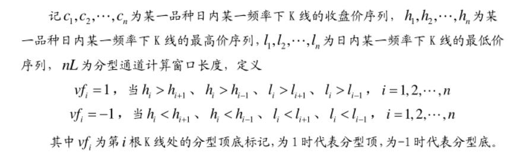
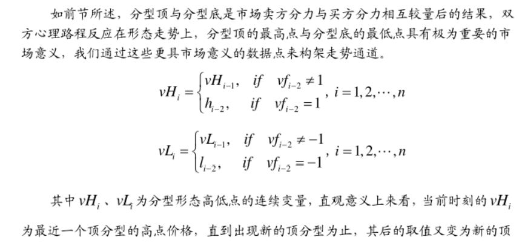
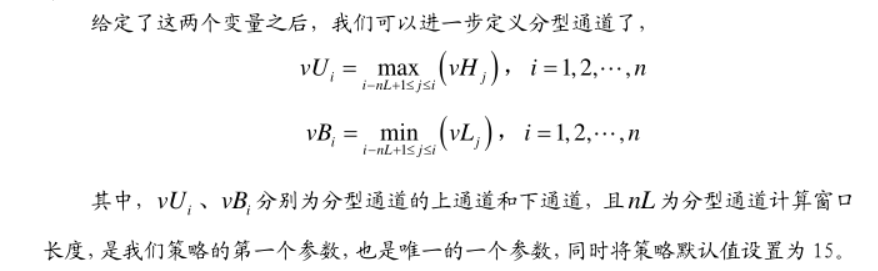

## Assignment2  
##### 广发证券  基于缠中说禅之分型通道趋势交易系统  另类交易策略研究之五

#### 交易模型  
分型通道趋势交易模型：  
利用分型顶底形态的高低点构建趋势通道，首先定义 vH、vL，其 T 时刻的取值分别为最近一个已形成的顶分型
的高点、最近一个已形成的底分型的低点，然后再取以 nL 为样本窗口宽度的滚动最高值和滚动最低值为通道的
上轨和下轨，并且当市场收盘价向上穿越上轨时发出开仓买多信号，当市场价格向下穿越下轨时发出开仓卖空信
号，至于何时平仓方面，仍然采用我们前期发布的收敛突变、日内波动极值策略中的平仓策略。
  
  
  

#### 复现结果
使用2022年5月到2023年5月沪深300股指期货15m数据进行实证分析（数据来源：聚宽），结果显示在设置止损条件下策略表现更好。  
与原文相比，策略在最近一年期间表现出胜率有所增加，但不设置止损时，最大回撤较大。
